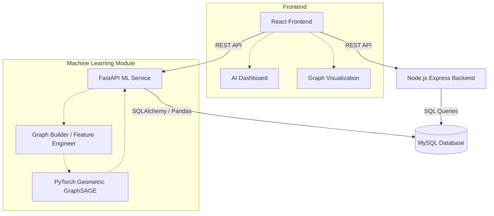

# Architecture Diagram

```mermaid
graph TD;
    Client[React Frontend] -->|REST API| NodeBackend[Node.js Express Backend];
    Client -->|REST API| MLService[FastAPI ML Service];
    NodeBackend -->|SQL Queries| DB[(MySQL Database)];
    MLService -->|SQLAlchemy / Pandas| DB;

    subgraph "Frontend"
        Client
        AIDashboard[AI Dashboard]
        GraphVis[Graph Visualization]
        Client -.-> AIDashboard
        Client -.-> GraphVis
    end

    subgraph "Machine Learning Module"
        MLService
        GraphBuilder[Graph Builder / Feature Engineer]
        Model[PyTorch Geometric GraphSAGE]
        MLService -.-> GraphBuilder
        GraphBuilder -.-> Model
        Model -.-> MLService
    end
```
