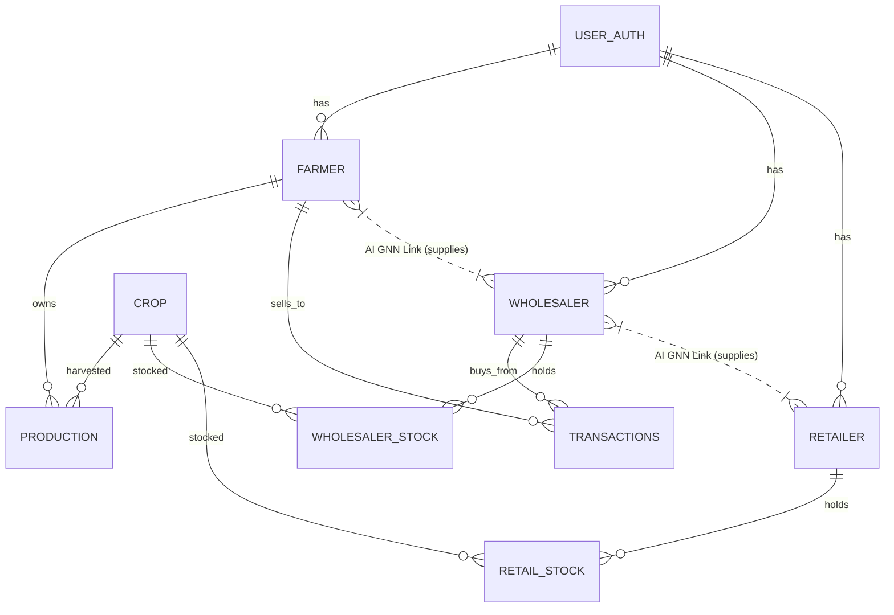

# Database Diagram (With AI Integration)

```mermaid
erDiagram
    USER_AUTH ||--o{ FARMER : has
    USER_AUTH ||--o{ WHOLESALER : has
    USER_AUTH ||--o{ RETAILER : has

    CROP ||--o{ PRODUCTION : harvested
    CROP ||--o{ WHOLESALER_STOCK : stocked
    CROP ||--o{ RETAIL_STOCK : stocked

    FARMER ||--o{ PRODUCTION : owns
    FARMER ||--o{ TRANSACTIONS : sells_to
    WHOLESALER ||--o{ TRANSACTIONS : buys_from
    
    WHOLESALER ||--o{ WHOLESALER_STOCK : holds
    RETAILER ||--o{ RETAIL_STOCK : holds
    
    %% AI Edges (Virtual)
    FARMER }|..|{ WHOLESALER : "AI GNN Link (supplies)"
    WHOLESALER }|..|{ RETAILER : "AI GNN Link (supplies)"
```
