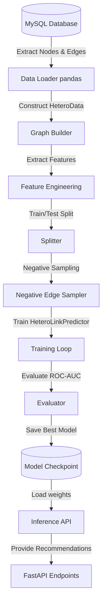

# ML Pipeline Diagram

```mermaid
graph TD;
    DB[(MySQL Database)] -->|Extract Nodes & Edges| DataLoader[Data Loader pandas];
    DataLoader -->|Construct HeteroData| GraphBuilder[Graph Builder];
    GraphBuilder -->|Extract Features| FeatureEngineering[Feature Engineering];
    FeatureEngineering -->|Train/Test Split| Split[Splitter];
    Split -->|Negative Sampling| NegSampler[Negative Edge Sampler];
    
    NegSampler -->|Train HeteroLinkPredictor| Trainer[Training Loop];
    Trainer -->|Evaluate ROC-AUC| Evaluator[Evaluator];
    Evaluator -->|Save Best Model| ModelStore[(Model Checkpoint)];
    
    ModelStore -->|Load weights| Inference[Inference API];
    Inference -->|Provide Recommendations| API[FastAPI Endpoints];
```
